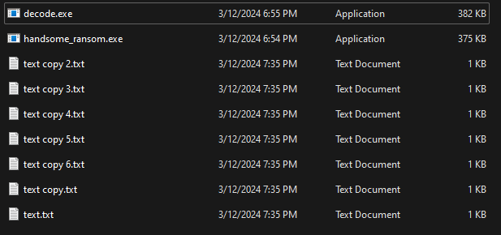
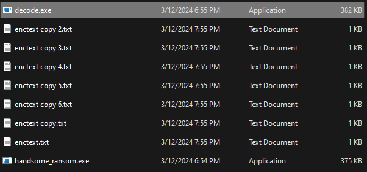

# <h1 align="center">Handsome Ransom</h1>

## <h1 align="center"> A ransom called handsome</h1>

### "Handsome Ransom" is a Nim-based encryption tool developed to highlight the language's file encryption capabilities. Though not a complete ransomware, it encrypts files using base64 encoding, showcasing Nim's potential in offensive security projects. This versatile tool can be easily modified to employ different encryption methods, opening doors for experimentation with various encryption techniques in cybersecurity applications.

- Make sure nim is installed and configured properly

#### you can build [handsome_ransom.nim](https://github.com/heshanthenura/handsome_ransom/blob/main/src/handsome_ransom.nim) file and [decode.nim](https://github.com/heshanthenura/handsome_ransom/blob/main/src/decode.nim) using the commands `nim c handsome_ransom.nim` and `nim c decode.nim`

this will generate two `.exe` files called `handsome_ransom.exe` and `decode.exe`

you can run `handsome_ransom.exe` to encrypt files 

when you want to decode files run `decode.exe` to decode the files. 
